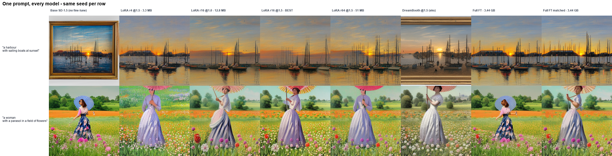

# Diffusion Models for Impressionist Artwork Generation

**Sagie Zaoui · Shenkar College — Neural Networks, final project**

**(1)** Implement & train a **DDPM from scratch** to understand the noise→denoise mechanism, then
**(2)** **fine-tune Stable Diffusion v1.5** to generate **Impressionist** artwork — documenting the
*full empirical process* (failed runs, analysis, hyper-parameter search, improvements).



## 🏆 Headline results

Measured on a **validated** metric: 2,048 images/model vs 2,800 held-out paintings, **240 prompts
containing zero style words**, with the real-vs-real FID floor re-measured at the same sample size
(**37.6**). Full table: [`experiments/RESULTS.md`](experiments/RESULTS.md).

| Model | FID ↓ | vs floor | CLIP ↑ | Size |
|---|---|---|---|---|
| 🥇 **LoRA r16 @×1.5** | **112.8** | +75.2 | 32.93 | **12.8 MB** |
| 🥈 LoRA r64 @×1.5 | 114.5 | +76.9 | **33.10** | 51 MB |
| Full fine-tune *(images-seen matched)* | 121.5 | +83.9 | 32.84 | **3.44 GB** |
| Base SD-1.5 *(no fine-tune)* | 128.3 | +90.7 | 32.72 | — |

1. **A 12.8 MB LoRA beats a 3.44 GB full fine-tune** (−8.7 FID at 0.37 % of the parameters).
   *Every* adapter we trained beats *both* full fine-tunes. Style adaptation is a **low-rank problem**.
2. **The LoRA inference scale is free performance** — ×1.0 → ×1.5 is worth **−6.5 FID**, no retraining.
3. **Our first evaluation was wrong, and we caught it ourselves.** At N=256, two sets of *genuine*
   Impressionist paintings scored **FID 156.7 against each other** — the metric could not tell real art
   from real art. Rebuilding it **reversed two conclusions we had already written down** (LoRA rank 64,
   and DreamBooth's trigger token) and exposed **an experiment we had never actually run**.
   → [`JOURNEY.md`](JOURNEY.md) §8

> The project's real thesis: **validate your measurement before you trust anything it tells you.**

## Hardware (measured)
NVIDIA **RTX 5090 (32 GB, Blackwell sm_120)** · Windows 11 · Python 3.12 (via `uv`) · PyTorch **cu128**.

## Setup
```powershell
powershell -ExecutionPolicy Bypass -File ".\environment\setup.ps1"
.\.venv\Scripts\Activate.ps1
python environment\verify_gpu.py   # expect: VERIFY_OK sm_120
```
See `environment/setup.log` for the install transcript.

## Layout
| Path | Contents |
|---|---|
| `PROJECT_BRIEF.md` | Master spec / goal prompt |
| **`TUTORIAL.md`** | **Hands-on guide: play with the models, prompt them, train, see metrics** |
| **`MODELS.md`** | **Model passports + the hyper-parameter story (what we tuned, what it cost)** |
| **`HYPERPARAMETERS.md`** | **Reference: every knob, what it means, our value, what breaks if wrong** |
| **`JOURNEY.md`** | **The process: roadmap, timeline, every failure → diagnosis → fix** |
| `environment/` | Setup, requirements, GPU verification |
| `src/phase1_ddpm_from_scratch/` | From-scratch DDPM (U-Net, diffusion, train, sample) |
| `src/phase2_sd_finetune/` | SD fine-tuning: LoRA / full / DreamBooth + eval |
| `src/common/` | Shared utilities (schedules, EMA, data, metrics, viz) |
| `experiments/` | Run logs, `RESULTS.md`, the evaluation result JSONs |
| `outputs/` | Sample grids, TensorBoard scalars, per-run configs *(see below)* |
| `related_work/` | Grounded literature review (real arXiv metadata) |
| `report/`, `slides/` | Write-up & presentation |

## 📦 What is — and isn't — in this repository

The working tree is **~20 GB**; this repo is **~70 MB**. Excluded content is **regenerable**, and
everything *cited as evidence* by the write-ups is included, so every artifact link resolves.

| ✅ Included (the evidence) | ❌ Excluded (regenerable) |
|---|---|
| All source code + all documentation | `.venv/` (5.1 GB) |
| **`outputs/phase1/*/samples/`** — the EMA noise→butterflies proof | Phase-1 checkpoints (572 MB each) |
| Phase-2 sample grids, first + last step of every run | Full-FT UNets (**3.44 GB** each) |
| **LoRA r16 (12.8 MB) + r4 (3.3 MB) weights** | 18,432 evaluation images (2.2 GB) |
| `report/figures/` — every figure | WikiArt dataset (525 MB) |
| `experiments/*.log` + result JSONs — the raw timeline | |
| TensorBoard scalars + per-run `config.json` | |

**The two LoRA adapters are deliberately shipped** so the headline claim is verifiable by anyone who
clones this — the *entire* fine-tuned model is 12.8 MB:

```bash
python src/phase2_sd_finetune/generate.py "a harbour with sailing boats at sunset"
```

To rebuild what's excluded: `python src/phase2_sd_finetune/prepare_data.py --max-images 1200 --holdout 300`
(dataset), then the trainers in [`TUTORIAL.md`](TUTORIAL.md) §6. The WikiArt imagery is also left out
to avoid redistributing it.

## 🔍 Verifying the claims

```bash
./metrics.sh          # every metric in the project, from the logged artifacts (PowerShell: .\metrics.ps1)
```

Reads the TensorBoard scalars and result JSONs committed here — Phase-1 training curves, the retracted
v1 table, and the final 9-model v2 evaluation. Nothing in the write-ups is hand-typed.

## Status
Complete. See the milestone checklist in `PROJECT_BRIEF.md` §10 and the final results in
[`experiments/RESULTS.md`](experiments/RESULTS.md).
