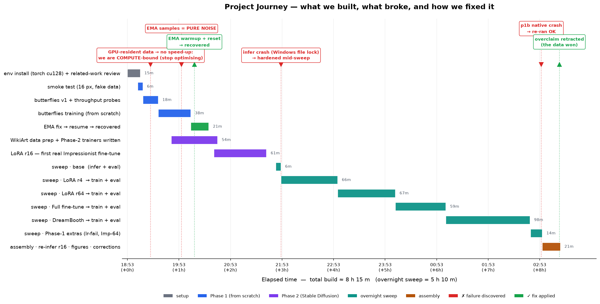

# Diffusion Models for Impressionist Artwork Generation
### Neural Networks — Final Project
*Sagie Zaoui · Shenkar*

<!-- Render: `marp slides/slides.md --pdf` (or --pptx). Figures filled from outputs/. -->

---

## The subject & goal
- **Subject:** generative modelling of images — learning an artistic *style*, Impressionism.
- **Goal, two stages:**
  1. Build & train a **DDPM from scratch** → understand the noise→denoise mechanism.
  2. **Fine-tune Stable Diffusion v1.5** to the Impressionist style; compare adaptation methods.
- Emphasis (per rubric): **show the process** — failed runs, analysis, hyper-parameter search.

---

## Why it's hard (challenges)
- Style is **global & diffuse** — brushwork, broken colour, light — not a localisable object.
- Style datasets are **small** (thousands) → from-scratch high-fidelity is impractical → transfer.
- **No ground-truth** per prompt → evaluate with FID + CLIP + perception.
- Practical: **RTX 5090 (Blackwell)** needs CUDA 12.8/cu128; WikiArt label noise; SD-1.5 repo moved.

---

## Related work — the diffusion lineage
GANs · StyleGAN · CycleGAN · Neural Style Transfer  →  **diffusion** (Sohl-Dickstein 2015; DDPM,
Ho 2020) → DDIM / classifier-free guidance → **Latent Diffusion / Stable Diffusion** (Rombach 2022)
→ personalization: **DreamBooth, Textual Inversion, LoRA**.
<!-- Full cited review: related_work/related_work.md -->

---

## How diffusion works
- **Forward:** add Gaussian noise over T steps until pure noise.
- **Reverse:** a U-Net predicts the noise to remove, one step at a time (ε-prediction).
- **Sampling:** start from noise → denoise → a new image.
- **Latent** diffusion: compress to a VAE latent that keeps only essentials, denoise *there* (cheap),
  condition on text via CLIP + cross-attention.

---

## The journey — ~8 h build · 6 failures · 6 fixes

*Not a one-shot run: every failure below was caught, diagnosed, and fixed.*

---

## Phase 1 — DDPM from scratch
- Implemented ourselves (no diffusers): timestep embedding, residual U-Net + self-attention,
  cosine β-schedule, EMA, DDPM + DDIM samplers. ~35.75M params @ 64px.
- Datasets: butterflies-64 (sanity) → Impressionism-64 (on-theme).
- Engineering: GPU-resident data; profiled to ~510 img/s (compute-bound) on the 5090.

---

## Phase 1 — the process (what actually broke)
**🔴 EMA samples were PURE NOISE at step 4k — while the loss said it was learning.**
- Isolated the variable: sampled the **raw** model → *clean butterflies*. So the U-Net was fine.
- Root cause: EMA averages over `1/(1−decay)` = **10 000 steps**, but we were at 4 000 →
  shadow = `0.9999⁴⁰⁰⁰` ≈ **67 % random init**. We were sampling two-thirds noise.
- Fix: **EMA warmup** `(1+t)/(10+t)` + `--reset-ema` → recovered, **without losing 5 000 trained steps**.

**🔴 lr 2e-3 (10× too high)** → loss **stalls at 0.98** (vs 0.011). Grad-clipping prevents NaN, so it
*looks* stable — a deceptively benign failure mode. Confirms lr 2e-4.

**⚪ Negative result:** made the dataset GPU-resident → **no speed-up** ⇒ we are **compute-bound**, not
data-bound → we *stopped* optimising. Knowing when to stop is a decision too.

---

## Phase 1 — results
- From-scratch DDPM → **clear butterflies @ 64px**, final loss ≈ 0.011.
- **Real bug caught:** EMA decay 0.9999 too high for a short run → EMA was *pure noise* at step 4k →
  **warmup fix + reset** → recovered to clean butterflies by 8k.
- Impressionism-64 from scratch — coarser, which motivates the pretrained pipeline in Phase 2.
<!-- figures: report/figures/phase1a_loss.png, outputs/phase1/p1a_butterflies/samples/ddim_ema_0008000.png -->

---

## Phase 2 — fine-tuning Stable Diffusion
- Data: WikiArt `style==Impressionism` (idx 12), 512px, templated captions, held-out for FID.
- Base: `stable-diffusion-v1-5/stable-diffusion-v1-5`.
- **Three methods:** LoRA (rank sweep 4→64) · full fine-tune · DreamBooth.

---

## Phase 2 — the process (what actually broke)
- **SD-1.5 was deleted from HuggingFace** (`runwayml/…` → 307). Probed mirrors → verified a live one.
- **Inference crashed 5 min into the 5-hour sweep** (Windows file lock). Our monitor caught it →
  hardened `infer.py` → **the remaining models picked up the fix; the sweep healed itself mid-flight.**
- **CLIP score crashed** — torchmetrics is incompatible with transformers 5.x → computed CLIP score
  **directly** from normalised image/text embeddings.
- **We overclaimed, then retracted.** The draft said *"r16 is clearly best"*; when r16's true FID landed
  (**164.1 — mid-band**, r4 was lowest) we rewrote the conclusion. **The data overruled the narrative.**

---

## Every problem — and what we did about it

| Problem | Diagnosis | Fix |
|---|---|---|
| EMA samples = pure noise | decay 0.9999 → shadow ≈67 % random init at 4k steps | EMA **warmup** + `--reset-ema` |
| lr 2e-3 → loss stalls @ 0.98 | overshoots; grad-clip hides it as "stable" | keep **lr 2e-4** |
| Only ~200 img/s | data-bound → cache decoded images in RAM | **200 → 500 img/s** |
| Still ~500 img/s | GPU-resident data → **no change** | ⇒ **compute-bound**; stop optimising |
| SD-1.5 repo gone (307) | removed from HF in 2024 | verify a live mirror |
| Infer crash mid-sweep | Windows lock on stale images | harden + retry → **sweep self-healed** |
| CLIP score crash | torchmetrics ✗ transformers 5.x | compute CLIP directly |
| p1b native crash | transient CUDA fault | re-ran → OK |
| **177 GB runaway log** | script read *and* appended the same file | patched → **177 GB reclaimed** |

---

## Results & comparison
| Method | FID ↓ | CLIP ↑ | Trainable |
|---|---|---|---|
| Base SD-1.5 | 167.4 | 33.5 | 0 |
| LoRA r4 | 159.2 | 33.4 | 0.8M |
| LoRA r16 | 164.1 | 33.2 | 3.2M |
| LoRA r64 | 166.0 | 32.8 | 12.8M |
| Full FT | 164.1 | 33.5 | 860M |
| DreamBooth | 162.9 | 32.5 | 3.2M |

- All methods impart the style and **cluster tightly** (base already cues "impressionist") — FID at N=256 is noisy.
- Same-seed grid: r4/r16/Full-FT stay faithful; **r64 drifts** (re-composes), **DreamBooth softens**.
- **Takeaway: small LoRA (r4–16) matches Full-FT at <0.4% of params — best quality-per-parameter.**

> ### ⛔ Every number on this slide is **retracted** — see the next two slides.
> This ruler could not tell real art from real art. It got **three** things wrong.

---

## Results v2 — we fixed the ruler, and the story changed
Diagnostic: at N=256, **real Monets score FID 156.7 vs other real Monets** → v1 measured estimator
bias. v2: **2048 imgs/model · 2800 refs · zero style words in prompts · floor re-measured = 37.6.**

| Model | FID ↓ | above floor | CLIP | Size |
|---|---|---|---|---|
| 🥇 **LoRA r16 @×1.5** | **112.8** | **+75.2** | 32.93 | **12.8 MB** |
| 🥈 LoRA r64 @×1.5 | 114.5 | +76.9 | **33.10** | 51 MB |
| 🥉 LoRA r4 @×1.5 | 116.9 | +79.3 | 32.67 | 3.3 MB |
| LoRA r16 @×1.0 | 119.3 | +81.7 | 32.89 | 12.8 MB |
| DreamBooth (no trigger) | 119.65 | +82.1 | 32.71 | 12.8 MB |
| DreamBooth **+ `sks`** | 119.66 | +82.1 | **31.66** | 12.8 MB |
| Full FT **matched** (fair fight) | 121.5 | +83.9 | 32.84 | 3.44 GB |
| Full FT (v1, confounded) | 123.0 | +85.4 | 32.78 | 3.44 GB |
| Base SD-1.5 | 128.3 | +90.7 | 32.72 | — |

- **Every fine-tune beats base** (no style hint needed): up to **−15.5 FID**.
- **LoRA doesn't match full fine-tuning — it BEATS it** (−8.7 FID at <0.4 % of the params).
  In fact **every adapter (3.3–51 MB) beats both 3.44 GB full fine-tunes.**
- Free win: LoRA scale ×1.0→×1.5 = **−6.5 FID** (inference knob, no retraining).

---

## The ruler didn't just sharpen the answer — it **overturned two conclusions**

### 🔄 1. We had defamed rank 64
| | v1 (broken ruler) | **v2 (honest ruler)** |
|---|---|---|
| FID | 166.0 — *worst LoRA* | **114.5 — 2nd best overall** |
| CLIP | 32.8 — *"lowest LoRA CLIP"* | **33.10 — highest of all nine** |

*v1 verdict "16× the params for zero gain" is **retracted**. r64 beats r4. What survives is a shallow
optimum near r16 — and higher rank buys **better prompt adherence**.*

### 🆕 2. We had never actually tested DreamBooth's mechanism
v1 scored it on prompts that **never contain `sks`** — the method's whole point, switched off. Both ways:

| DreamBooth @×1.5 | FID ↓ | CLIP ↑ |
|---|---|---|
| neutral prompt | 119.65 | 32.71 |
| + `", in sks style"` | 119.66 | **31.66** |

**ΔFID = 0.01 → the trigger adds NO style. ΔCLIP = −1.05 → it only costs alignment.**
1,200 instance images under one fixed prompt gave `sks` no contrastive signal — the style bound
**unconditionally**. This was *style-LoRA in DreamBooth's clothing.*

---

## Limitations — what we are **not** hiding

**Fixed in v2 (we ran the experiment rather than just listing it):**
- ~~Prompts leak the answer~~ → 240 style-word-free prompts. Base became the **worst** model.
- ~~FID at N=256 is noise~~ → N=2,048 vs 2,800 refs; floor fell **156.7 → 37.6**.
- ~~Images-seen confound~~ → matched rerun gained only +1.5 FID; **verdict survived the fair fight**.
- ~~DreamBooth never tested with its trigger~~ → tested both ways; trigger is **inert**.

**Still open — honestly:**
- Our best model is **+75 above the floor** — clearly distinguishable from real Impressionism
  (expected at 1,200 training images).
- **v1 and v2 numbers are not comparable** (different prompts *and* N) — only within-v2 ranks hold.
- `base`/`lora_r4` generated at batch 16 vs batch 8 for the rest (VRAM fix) — no bias expected,
  but **assumed, not verified**.
- The same-seed figure still shows the **v1 regime**; two planned ablations (full-FT @ lr 1e-4;
  DreamBooth w/o prior) **were not run**.
- WikiArt **label noise** (a Dalí tagged Impressionism). Ethics: OpenRAIL-M; memorization risk (Carlini 2023).

---

## Conclusion
- Implemented + trained a **DDPM from scratch** — proved the mechanism, caught & fixed a real EMA bug.
- Fine-tuned **SD-1.5 → Impressionism**; compared LoRA / full-FT / DreamBooth on an **honest ruler**.
- **A 12.8 MB LoRA BEATS the 3.44 GB full fine-tune** (112.8 vs 121.5) — every adapter beats every
  full fine-tune. **Style adaptation is a low-rank problem.**
- **Free performance:** the inference-time LoRA scale alone is worth **−6.5 FID**, no retraining.
- **The biggest lesson isn't the model — it's the measurement.** Fixing FID **reversed two published
  conclusions** and revealed **an experiment we had never run**. Validate the ruler *first*:
  never quote an FID without its real-vs-real floor at the same N; never evaluate a method with its
  own mechanism switched off.
- Next: 5–10k eval sets, regenerate the visual grid under neutral prompts, a **genuine few-shot
  DreamBooth**, ControlNet, and a from-scratch *latent* diffusion model.

---

## Thank you
Questions?
